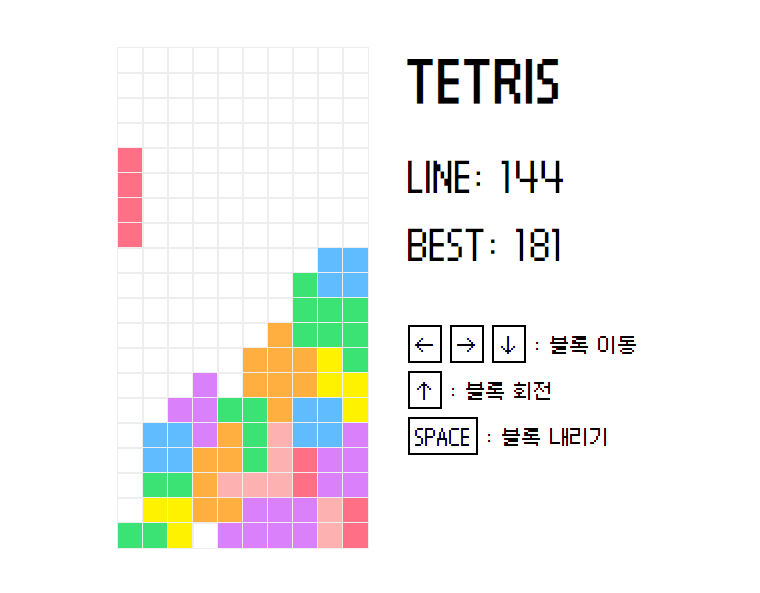
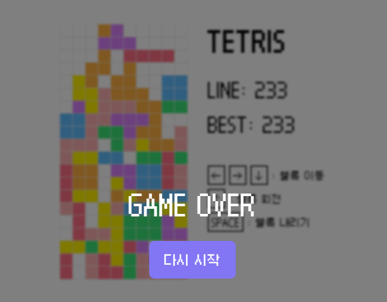

# TETRIS

### 🔗링크
https://asdf080.github.io/TETRIS/

### 🔎소개
바닐라 JS로 만든 테트리스 게임입니다.

### 📅제작 기간
2024.01.05 ~ 2024.01.06

### 🗂개발 환경
- HTML
- CSS
- JavaScript

### 🎈주요 기능
- createElement, childNodes 등 DOM 제어를 이용한 블록 생성
- childNodes를 이용한 한줄 완성 체크
- 로컬 스토리지를 이용한 점수 저장

### ✔ 미리보기

